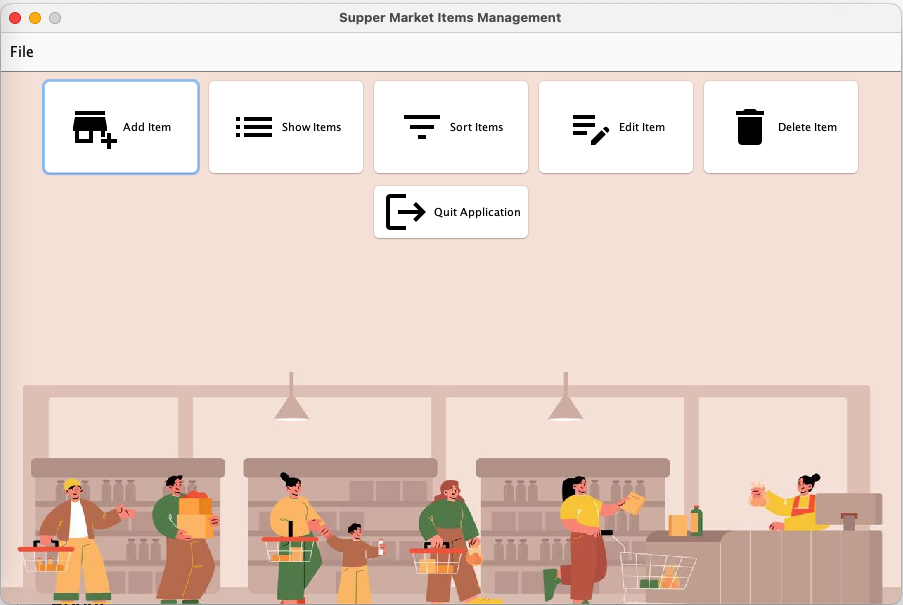
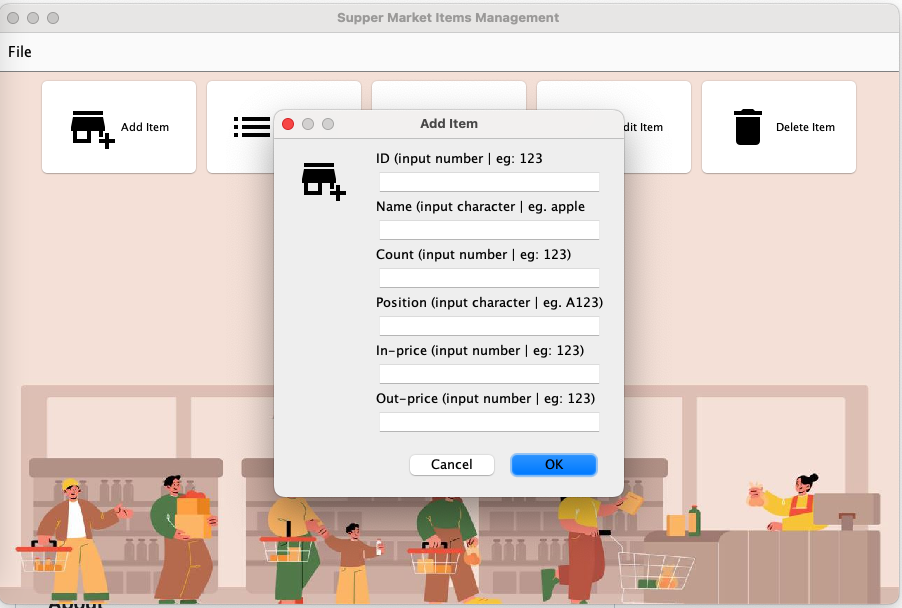

# **Grocery Management App**

#### **Personal Project**

#### About

A simple application that manages items with information including ID, name, quantity, position, price in the supermarket.

Users can add and delete an item, show and sort items, and edit all item's properties

The app's main functions are:

* Add, delete an item
* Show and sort items by quantity
* Modify properties of a selected item
* Save and load items' data when the application starts

Implemented methods are:

* Implementing a hierarchy, data abstractions, interfaces, testing, and GUI Swing.

### Installation

To run the program, run grocery-management-app/src/main/ui/MainGUI.java

The main user interface

Pop-up window to add item

