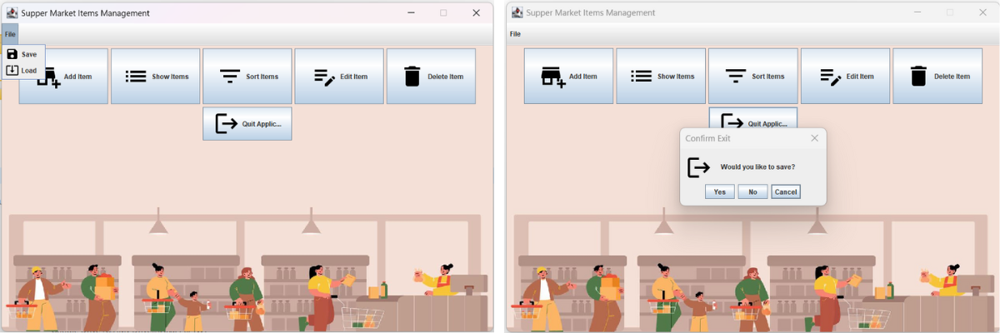
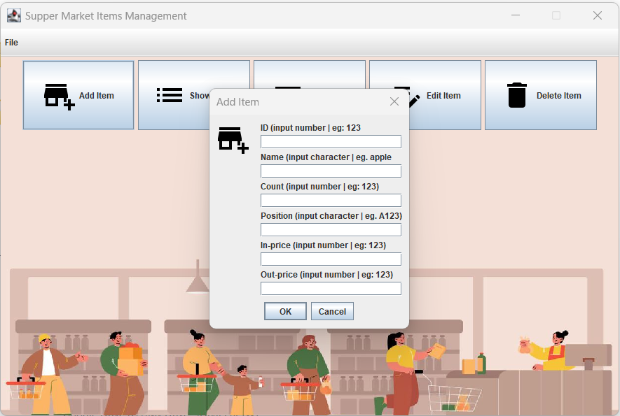

# **Grocery Management App**

## About
I developed this program from scratch by applying Systematic Software Construction in Java after completing a course in
[Software Construction: Object-Oriented Design](https://www.edx.org/course/software-construction-object-oriented-design) at UBC. 

A tiny application that manages items in a grocery with information including **ID, name, quantity, position, 
price** in the supermarket.

Users can interact with the app by adding and deleting an item, showing and sorting items, and editing all item's properties

#### The app's main features

1. Add, delete an item
2. Show and sort items by quantity
3. Modify properties of a selected item
4. Save and load items' data when the application starts and exits

Implemented methods are:

* Approaching by using top-down systematic design and implementing a hierarchy, data abstractions, interfaces, testing,
and GUI Swing.

#### Graphical User Interface

The main user interface with "Load" data when starting and "Save" data when
exiting the program

Clicking "Add Item", a Pop-up window shows up to add an item

## Installation

To run the program, run **grocery-management-app/src/main/ui/MainGUI.java**

